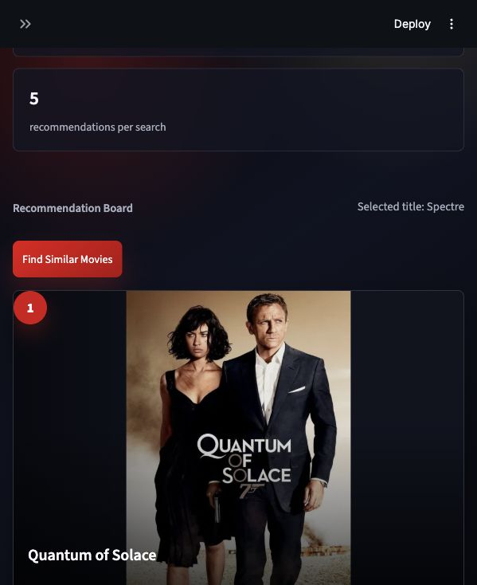

# Movie Recommendation System

A clean, cinematic movie recommendation web app built with Python, Streamlit, and a content-based recommendation model trained in a Jupyter notebook.

This project is designed as an interview and portfolio showcase: simple enough to understand quickly, polished enough to present professionally, and faithful to the original notebook-based machine learning workflow.

## Preview



## Overview

The system recommends similar movies based on movie metadata such as genres, keywords, cast, crew, and overview text. The recommendation logic is built in `Main_Model.ipynb`, while `app.py` provides a modern Streamlit interface around the trained notebook workflow.

The Streamlit app also integrates with the TMDB API to display movie posters for recommended titles.

## Features

- Content-based movie recommendations
- Streamlit web interface
- Dark cinematic UI
- Movie poster cards using TMDB API
- Search or select a movie title
- Displays recommended movie title, year, rating, and TMDB id
- Graceful fallback when posters are unavailable
- Simple local setup with `.env` API key handling

## Tech Stack

- Python
- Streamlit
- Pandas
- NumPy
- Scikit-learn
- NLTK
- TMDB API
- Jupyter Notebook

## Project Structure

```text
Movie-Recommendation-system/
├── app.py
├── Main_Model.ipynb
├── README.md
├── requirements.txt
├── .gitignore
├── .env.example
├── tmdb_5000_movies.csv
├── tmdb_5000_credits.csv
└── assets/
    └── app-preview.png
```

## Installation

Clone the repository and move into the project folder:

```bash
git clone <your-repository-url>
cd Movie-Recommendation-system
```

Create and activate a virtual environment:

```bash
python3 -m venv venv
source venv/bin/activate
```

Install dependencies:

```bash
pip install -r requirements.txt
```

## API Setup

This app uses TMDB to fetch movie posters.

Create a `.env` file in the project root:

```bash
cp .env.example .env
```

Add your TMDB API key:

```text
TMDB_API_KEY=your_tmdb_api_key_here
```

The `.env` file is ignored by Git, so your private API key will not be committed.

## Run Locally

```bash
streamlit run app.py
```

Then open the local URL printed by Streamlit, usually:

```text
http://localhost:8501
```

If port `8501` is already in use, Streamlit may open another port such as `8502`.

## How It Works

1. `Main_Model.ipynb` loads and processes the TMDB movie datasets.
2. Movie metadata is converted into text tags.
3. Tags are vectorized using Bag of Words.
4. Cosine similarity is used to find similar movies.
5. `app.py` loads the notebook-created recommendation artifacts and displays results in Streamlit.
6. TMDB poster images are fetched separately for visual presentation only.

The recommendation logic remains inside the notebook and is not replaced by the frontend.

## Dataset

The project uses:

- `tmdb_5000_movies.csv`
- `tmdb_5000_credits.csv`

These files should stay in the project root because the notebook expects them there.

## Future Improvements

- Add a deployed Streamlit Community Cloud link
- Add genre-based filters
- Add top trending movie section
- Improve mobile card spacing
- Add optional poster caching to disk

## Notes

This project intentionally keeps a simple structure. It is meant to be easy to run, easy to review, and suitable for interviews or placement portfolio submissions.
